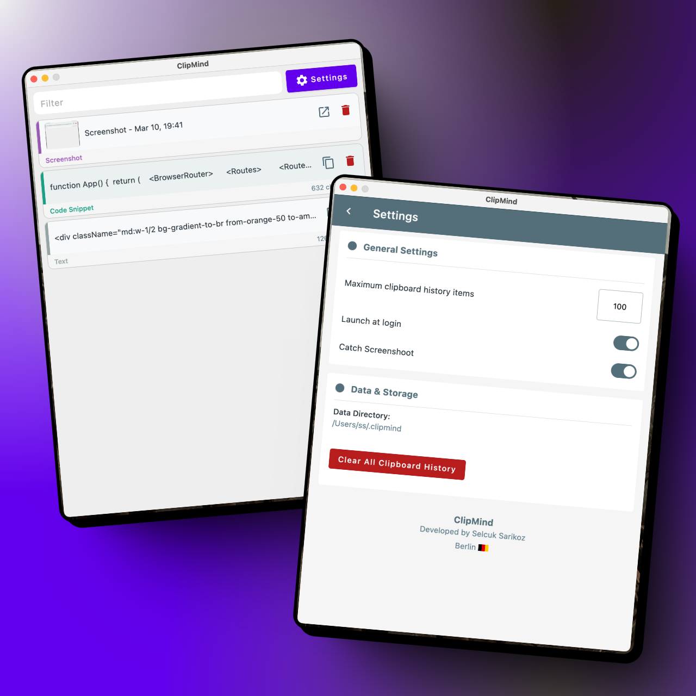

## ClipMind

**An intelligent clipboard manager that remembers, so you don't have to**

ClipMind tracks everything you copy, storing it securely within the app. Easily retrieve your copy
history and access previously copied text whenever you need it.

**Quick Access**: Press `cmd + option + v` to open the app right where your cursor is positioned.

#### Key Features

- **Complete Copy History**: Never lose important text again
- **Smart Search**: Quickly find what you copied days or weeks ago
- **Cross-platform**: Available on macOS (coming soon for Windows, Linux)